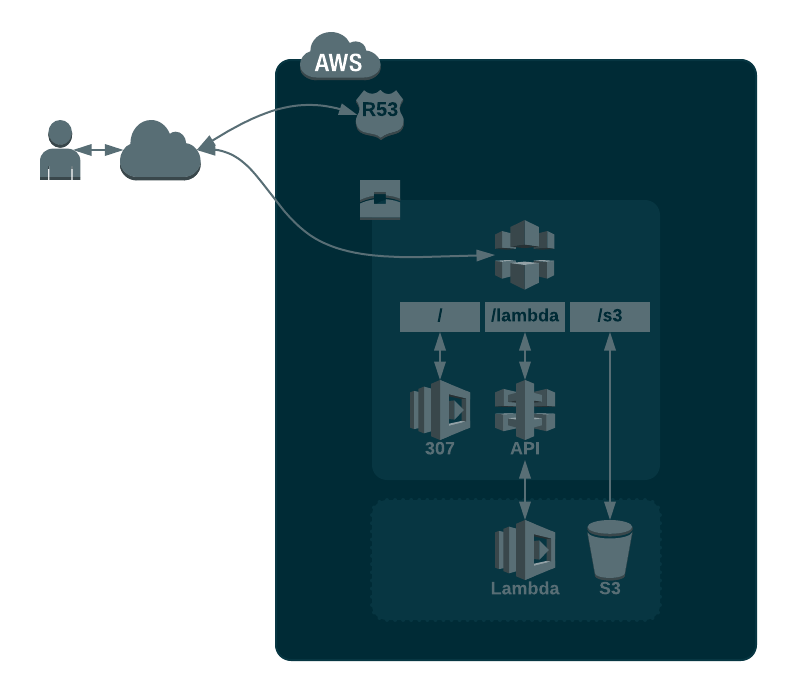

# Dan-Sullivan.co.uk

[dan-sullivan.co.uk](dan-sullivan.co.uk) is my personal site, used to demonstrate familiarity with a variety of technologies and concepts. Similarly, this repository contains and documents the various code and configuration used to build the site.

## Goal

As the goal is to demonstrate common DevOps concepts like infrastructure as code and automation, the site content is extremely simple. Hitting the root of the site will redirect you to the same page served by different methods. The intention being to grow the methods.

- AWS Lambda  
- AWS S3

## Infrastucture



Infrastructure is built with Terraform and hosted in AWS. The configurations are therefore split, seperating rarely changing and sensitive resources (e.g. Route 53 and IAM Policies) and constantly changing, like dev and production environments. These are linked together through remote state data resources.

## Continuous Integration and Deployment

CI and Continuous Deployment is handled by Circle CI with a Github integration.
Opening a pull request on Github will trigger a new build of the PR able to be tested.

Pull Request URL: `https://dan-sullivan.co.uk/pr#/pr#/s3/`

Merging a PR (or anything) into the master branch will trigger a deployment to the production environment.


## Frontend

### Overview
[Grunt](https://gruntjs.com) is used to pull all the html, css and javascript together and to prepare the different versions of the site for distribution.

Watch and Livereload plugins assist with rapid development.

[Skeleton-Sass](https://github.com/WhatsNewSaes/Skeleton-Sass), the [Sass](http://sass-lang.com) version of the simple, responsive [Skeleton CSS](http://getskeleton.com) framework was chosen to keep things very light. No need for bootstrap, jquery here. 

[Sass](http://sass-lang.com) is used to assist with CSS development, particularly useful for adding variables.

## Development Environment

### Install Global Dependencies
  * [Node.js](http://nodejs.org)
  * [bower](http://bower.io): `[sudo] npm install bower -g`
  * [grunt.js](http://gruntjs.com): `[sudo] npm install -g grunt-cli`

### Install Local Dependencies
  * run `[sudo] npm install` (first time users)
  * run `grunt` (to watch and compile sass files)

### Grunt Tasks
`grunt lambda` - build lambda specific version of page  
`grunt s3cf` - build s3 specific version of page  
`grunt serve` - serve `./dist` on http://localhost:9000. Watch html, css, js and template files triggering a rebuild on save. Livereload injection included to avoid having to use browser extensions - great for mobile.  


`grunt exec:zip_lambda_dscouk` - Zip all files required for uploading to lambda.  
`grunt exec:upload_s3cf` - upload the s3 version of the page.  
`grunt exec:invalidate_cf` - invalidate the cloudfront cache.  

### CircleCI
Circle CI uses a customised Docker image with Terraform and the AWS CLI installed. 
Details can be found in `.circleci/config.yml` and the Dockerfile in `.circleci/images/Dockerfile`.

## Infrastructure Diagram
The infrastructure diagram was built with Lucidchart. I then exported it as an SVG, manually grouped the elements and paths into layers with Inkscape and again saved as an optimised SVG (with a viewport to enable scaling). The fill and stroke attributes were the converted to classes with some regex and Vim search/replace. This will then enable me to change them with standard CSS and add them to the Sass CSS build.  

```
Stroke and Fill:
:%s/\v(stroke\=\"(\#.{6}|none)\")(.*)(fill\=\"(\#.{6}|none)\")/\3 class="stroke-\2 fill-\5"/g

Note: shouldnt need the nested capture groups on that actually.

Fills only:
:%s/\vfill\=\"(\#.{6}|none)\"/class="fill-\1"/g

Strokes only: 
:%s/\vstroke\=\"(\#.{6}|none)\"/class="stroke-\1"/g
```

Using Sass, the various original colours were then mapped to Solarized options via the classes created early.

Animation to come and will be done by hand with CSS Keyframes.


# Further Credits

- The popular [Solarized](http://ethanschoonover.com/solarized) colour scheme is used, chosen simply because it matches my current terminal colours. 
- Github user frebro had already created a [Sass module](https://github.com/frebro/sass-solarized/blob/master/_solarized.scss) to map the colours to variables.
- [Typed.js](https://mattboldt.com/demos/typed-js/) for the typing text gimmick
